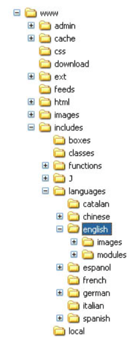

## 多语种的支持

对于多语种的支持,要求从两方面实现, 一是界面的语言切换, 二是实际数据的语言切换(如产 品名称及描述等)。我们先来讨论针对界面的多语种支持。

### 界面



如图所示为 osCommerce 的目录结构, 所有执行文件位于根目 录 www,所有语言文件位于“includes/languages/LANGUAGE/”里, 其中的 LANGUAGE 为语言的名称,如 english,chinese,french 等。 为了实现方便的语言切换,osCommerce 实现的是文件名对应制, 即语言文件的名称与执行文件一致(这是一种通用且实用的处理方 法,实际上系统并未对此做严格限制,下面的代码将说明这一点)。

下面以 address_book 地址簿为例来说明多语言切换的运行原理。

执行文件 address_book.php[13]

```php
require('includes/application_top.php');
    if (!tep_session_is_registered('customer_id')) {
      $navigation->set_snapshot();
      tep_redirect(tep_href_link(FILENAME_LOGIN, '',
'SSL')); }
    require(DIR_WS_LANGUAGES . $language . '/' .
FILENAME_ADDRESS_BOOK);
```

第 20 行的代码说明了该文件要求调用名称为 FILENAME_ADDRESS_BOOK 的语言文件,
因为在“includes/configure.php”配置文件里,已经定义了 DIR_WS_LANGUAGES 即为
“includes/languages/”。

```php
define('DIR_WS_INCLUDES', 'includes/');
define('DIR_WS_LANGUAGES', DIR_WS_INCLUDES . 'languages/');
```

那么$language 变量又是怎样自动对应到不同的语言目录的呢? 我们来看预处理部分,所有页面在执行自身代码前都会进行预处理

程序预处理 includes/application_top.php[268]
```php
if (!tep_session_is_registered('language') || isset($HTTP_GET_VARS['language'])) {
  if (!tep_session_is_registered('language')) {
    tep_session_register('language');
    tep_session_register('languages_id');
  }
  include(DIR_WS_CLASSES . 'language.php');
  $lng = new language();
  if (isset($HTTP_GET_VARS['language']) &&
 tep_not_null($HTTP_GET_VARS['language'])) {
    $lng->set_language($HTTP_GET_VARS['language']);
  } else {
    $lng->get_browser_language();
  }
  $language = $lng->language['directory'];
  $languages_id = $lng->language['id'];
}
// include the language translations
require(DIR_WS_LANGUAGES . $language . '.php');
```

由$HTTP_GET_VARS['language']传入要切换的语言名称(实际为语言的 code 值),然后通过 language 类的 set_language 方法来设置新的语言,取得新语言的目录名与语言 ID,并保存至 session。 

如果是第一次运行并且未指定$HTTP_GET_VARS['language']时,系统会调用 language 类的get_browser_language 方法,按用户的浏览器语言自动切换对应语种。

第 288 行的代码作用是载入对应语言的全局语言常量,该文件保存了不限于单个文件的语言
常量。

### 数据

对于在线销售的软件,最基础的管理是产品,所以我们就对产品数据的多语言支持进行说明。

首先来看于语言相关的产品描述 products_description 表的结构
<div>
<table>
<tbody>
<tr>
<td>
<div class="layoutArea">
<div class="column">
<p>字段名</p>
</div>
</div>
</td>
<td>
<div class="layoutArea">
<div class="column">
<p>类型</p>
</div>
</div>
</td>
<td>
<div class="layoutArea">
<div class="column">
<p>允许空</p>
</div>
</div>
</td>
<td>&nbsp;</td>
<td>
<div class="layoutArea">
<div class="column">
<p>键</p>
</div>
</div>
</td>
<td>&nbsp;</td>
<td>
<div class="layoutArea">
<div class="column">
<p>默认值</p>
</div>
</div>
</td>
<td>
<div class="layoutArea">
<div class="column">
<p>扩展</p>
</div>
</div>
</td>
</tr>
<tr>
<td>
<div class="layoutArea">
<div class="column">
<p>products_id</p>
</div>
</div>
</td>
<td>
<div class="layoutArea">
<div class="column">
<p>int(11)</p>
</div>
</div>
</td>
<td>
<div class="layoutArea">
<div class="column">
<p>NO</p>
</div>
</div>
</td>
<td colspan="3" rowspan="1">
<div class="layoutArea">
<div class="column">
<p>PRI</p>
</div>
</div>
</td>
<td>
<div class="layoutArea">
<div class="column">
<p>NULL</p>
</div>
</div>
</td>
<td>
<div class="layoutArea">
<div class="column">
<p>auto_increment</p>
</div>
</div>
</td>
</tr>
<tr>
<td>
<div class="layoutArea">
<div class="column">
<p>language_id</p>
</div>
</div>
</td>
<td>
<div class="layoutArea">
<div class="column">
<p>int(11)</p>
</div>
</div>
</td>
<td>
<div class="layoutArea">
<div class="column">
<p>NO</p>
</div>
</div>
</td>
<td colspan="3" rowspan="1">
<div class="layoutArea">
<div class="column">
<p>PRI</p>
</div>
</div>
</td>
<td>
<div class="layoutArea">
<div class="column">
<p>1</p>
</div>
</div>
</td>
<td>&nbsp;</td>
</tr>
<tr>
<td>
<div class="layoutArea">
<div class="column">
<p>products_name</p>
</div>
</div>
</td>
<td>
<div class="layoutArea">
<div class="column">
<p>varchar(64)</p>
</div>
</div>
</td>
<td>
<div class="layoutArea">
<div class="column">
<p>NO</p>
</div>
</div>
</td>
<td colspan="3" rowspan="1">
<div class="layoutArea">
<div class="column">
<p>MUL</p>
</div>
</div>
</td>
<td>
<div class="layoutArea">
<div class="column">
<p>NULL</p>
</div>
</div>
</td>
<td>&nbsp;</td>
</tr>
<tr>
<td>
<div class="layoutArea">
<div class="column">
<p>products_description</p>
</div>
</div>
</td>
<td>
<div class="layoutArea">
<div class="column">
<p>text</p>
</div>
</div>
</td>
<td>
<div class="layoutArea">
<div class="column">
<p>YES</p>
</div>
</div>
</td>
<td colspan="3" rowspan="1">&nbsp;</td>
<td>
<div class="layoutArea">
<div class="column">
<p>NULL</p>
</div>
</div>
</td>
<td>&nbsp;</td>
</tr>
<tr>
<td>
<div class="layoutArea">
<div class="column">
<p>products_url</p>
</div>
</div>
</td>
<td>
<div class="layoutArea">
<div class="column">
<p>varchar(255)</p>
</div>
</div>
</td>
<td>
<div class="layoutArea">
<div class="column">
<p>YES</p>
</div>
</div>
</td>
<td colspan="3" rowspan="1">&nbsp;</td>
<td>
<div class="layoutArea">
<div class="column">
<p>0</p>
</div>
</div>
</td>
<td>&nbsp;</td>
</tr>
<tr>
<td>
<div class="layoutArea">
<div class="column">
<p>products_viewed</p>
</div>
</div>
</td>
<td>
<div class="layoutArea">
<div class="column">
<p>int(5)</p>
</div>
</div>
</td>
<td>
<div class="layoutArea">
<div class="column">
<p>YES</p>
</div>
</div>
</td>
<td colspan="3" rowspan="1">&nbsp;</td>
<td>&nbsp;</td>
<td>&nbsp;</td>
</tr>
</tbody>
</table>
</div>

产品表是由 products 和 products_description 组成(暂不讨论产品属性与产品目录等),它们由 products_id 关联,products 存放的是最基本的型号、价格等因素,而 products_description 则存放 产品名称、产品描述等内容。

在上表中,language_id 字段决定了此一描述的对应语言。 

下面是 product_info.php 的加载产品的代码。

产品详细页 product_info.php [72]

```php
$product_info_query = tep_db_query("select p.products_id, pd.products_name, pd.products_description, p.products_model, p.products_quantity, p.products_image, pd.products_url, p.products_price, p.products_tax_class_id, p.products_date_added, p.products_date_available, p.manufacturers_id from " . TABLE_PRODUCTS . " p, " . TABLE_PRODUCTS_DESCRIPTION . " pd where p.products_status = '1' and p.products_id = '" . (int)$HTTP_GET_VARS['products_id'] . "' and pd.products_id = p.products_id and pd.language_id = '" . (int)$languages_id . "'");
```

在加载产品时,通过 pd.language_id = (int)$languages_id,来指定载入相应语言的描述,便实 现了产品内容的语言切换。