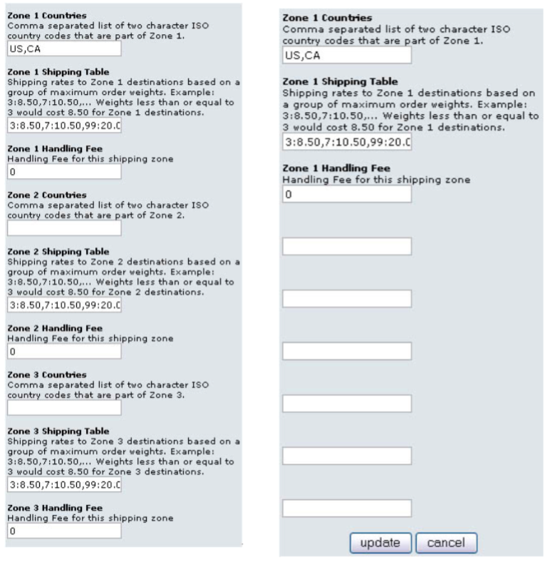

## 了解运输模块

### 运输模块的安装

进入 osCommerce 后台,点击 modules->shipping。


上面显示出所有可用的运输模块,其中Sort Order有值的为已安装的模块,其它的则为尚未安装模块。

点击要安装的模块名称,我们以 Zone Rates 模块为例,进行说明。 点击右边的“Install”按钮,然后点击“Edit”按钮。


如图显示了 Zone Rates 运输模块的所有配置参数。

Zone Rates模块是可针对指定的国家,自定义重量与价目表来计算运费的模块。下面来看它的所有参数:

- Enable Zones Method:是否激活此模块
    所有模块都会有与此相同的激活选项,由此可以看出,一个模块的可用必须在已安装和已激活两个条件的基础上。
- Tax Class:使用哪种税类
    如果需要计算运费的税时,可使用此功能。
    --none—的选项表示不使用税类。
- Sort Order:排序号
    这里指定该模块在用户选择运输方式时显示的位数。
    排列为由小到大,0 为最上面,序号相同时按安装顺序排列。
- Zone 1 Countries: 此参数设置限制哪些国家使用这个运费表
    在这里应填入国家的 ISO CODE2(可参 考附录:《国家ISO CODE代码》),多 个国家使用“,”逗号进行分隔。
- Zone 1 Shipping Table:指定运费表
    运费表的格式为:重量一:价格一,重 量二:价格二,重量三:价格三...... 公式的意义为:如果总重量小于或等于重量一,则运费为价格一。
    如果总重量 大于重量一,但小于或等于重量二,则 运费为价格二,以此类推。
- Zone1HandlingFee:指定针对上面国家收取的手续费


> 注意:
> 
> osCommerce RC2 没有重量的计量单位,所以这里的重量既不能完全说是克,也不能说是千 克。因此在osCommerce 里,重量单位是完全依照用户自己的设计来使用的,也就是说如果用户 在产品的 Weight 项填入的是克,那么在运费表设置时就应以克为计算单位,如果以盎司为单位, 则运费表也就以盎司为单位。
> 
> 不过 Zone Rates 模块默认使用了 lbs 的单位,如果与你的单位不符,我们将在下面的内容提 及如何进行修改。

### 运输模块的显示

在上面,我们仅设置了美国和加拿大,才使用我们的 Zone Rates 运费表计算。
当我们把国家设置为“American Samoa”时,可以看到 Zone Rates 的选项是不可用的。


当我们把国家改为美国时,Zone Rates 选项便可选了。


### 自定义模块功能

#### 更改Zone Rates模块的计量单位

Zone Rates 的单位只是显示的单位,并未进行单位的换算,所以它的单位定义在其语言文件里。 

打开“includes/languages/LANGUAGE/modules/shipping/zones.php”,其中 LANGUAGE 为你要设 置的语种。

Zoner Rates 语言文件 includes/languages/LANGUAGE/modules/shipping/zones.php [16]

```php
define('MODULE_SHIPPING_ZONES_TEXT_UNITS', 'lb(s)');
```

将其中的“lb(s)”替换成你要设置的单位,如“kg”。代码为: 

```php
define('MODULE_SHIPPING_ZONES_TEXT_UNITS', 'kg');
```

保存文件,Zone Rates 新显示单位即告生效。


#### 扩展Zone Rates 的区域运费表

上面我们看到 Zone Rates 的参数表里,显示的是 Zones Zone 1 Countries,Zone 1 Shipping Table 以及 Zone 1 Handling Fee,如果我们想要设置多个不同的国家以及多个运费表,是不是可以进行 扩展呢?答案是完全可以。

其实 Zone Rates 模块默认是支持多个区域的运费设置的,所以我们的想法可以非常容易地实现。

Zone Rates 模块 includes/modules/shipping/zones.php [111] 

```php
$this->num_zones = 1;
```

将上面的“1”改为想要扩展的数目,如“3”,我们可以看到修改后的效果。



> 提示:
> 修改过扩展数量后,需要先 Remove 模块,然后重新安装它,否则会出现下面的现象,扩展的参数不会生效。


